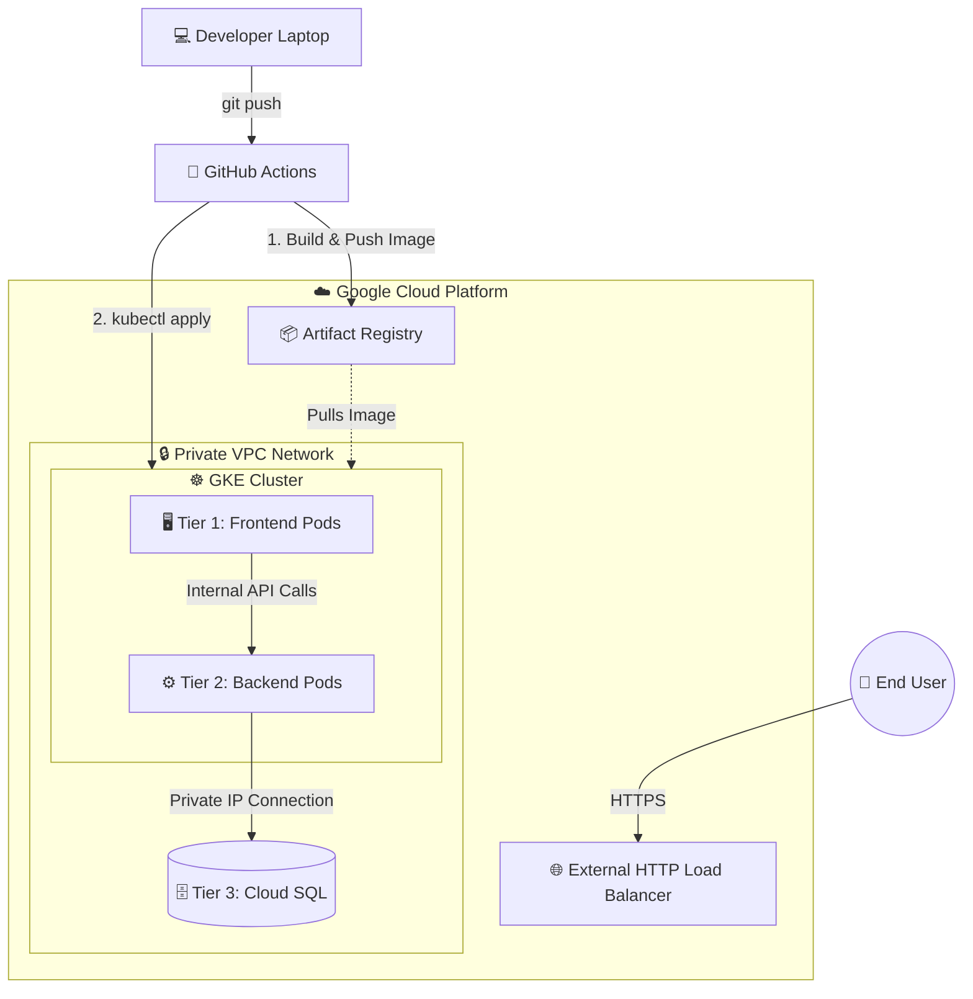

## System Architecture

Here is the blueprint for our 3-tier GKE deployment:

```mermaid
graph TD
    User((👤 End User)) -->|HTTPS| LB[🌐 External HTTP Load Balancer]

    subgraph GCP [☁️ Google Cloud Platform]
        direction TB
        LB
        AR[📦 Artifact Registry]
        
        
        subgraph VPC [🔒 Private VPC Network]
            direction TB
            subgraph GKE [☸️ GKE Cluster]
                FE[🖥️ Tier 1: Frontend Pods] -->|Internal API Calls| BE[⚙️ Tier 2: Backend Pods]
            end
            BE -->|Private IP Connection| DB[(🗄️ Tier 3: Cloud SQL)]
        end
    end

    Laptop[💻 Developer Laptop] -->|git push| GitHub[🐙 GitHub Actions]
    GitHub -->|1. Build & Push Image| AR
    GitHub -->|2. kubectl apply| GKE
    AR -.->|Pulls Image| GKE
```
